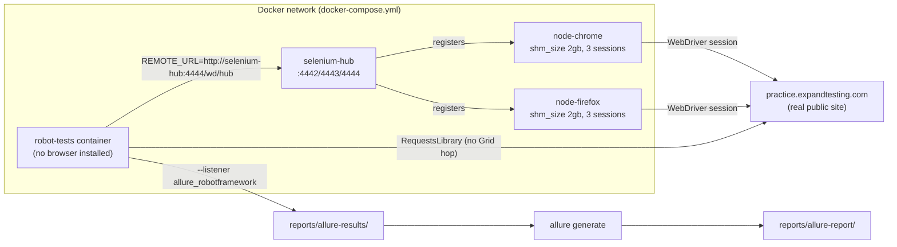
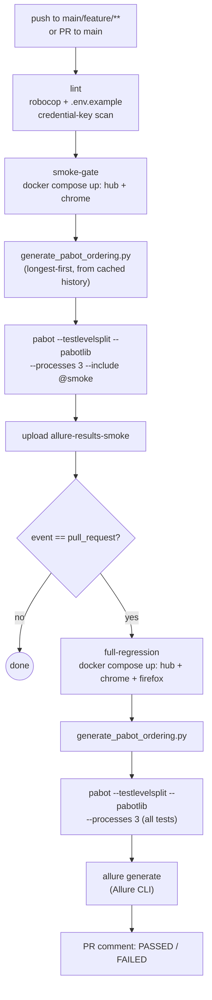
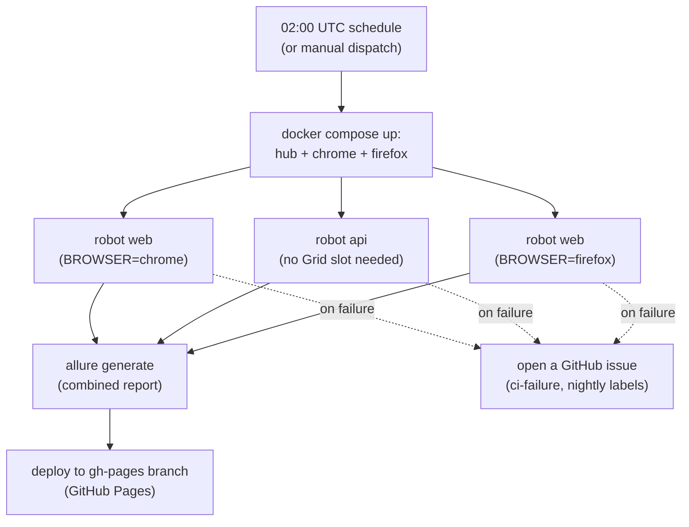
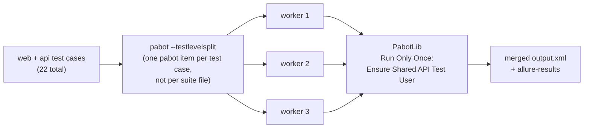

# System Architecture

This document shows how the pieces in this repo actually connect at runtime
and in CI - the Selenium Grid, the Docker network, the pabot parallel run,
and the Allure reporting pipeline. For the code-level Page Object Model
layering (`shared/` → `data/` → `resources/` → `tests/`), see
[docs/POM_ARCHITECTURE.md](POM_ARCHITECTURE.md).

## Runtime: Docker Compose network

`robot-tests` is a pure Grid client - it has no browser of its own, only a
headless JRE and the Allure CLI (see `Dockerfile`). API tests bypass the Grid
entirely: `RequestsLibrary` talks to `practice.expandtesting.com` directly,
so `api/` tests never consume a Grid session slot.

## CI/CD: `ci.yml` (push / PR)

Both Grid-dependent jobs share the same shape: create `.env` → pull images →
bring up the Grid → wait for hub readiness → run pabot → tear down (`if:
always()`), with a `Dump Grid container status/logs on failure` step so a red
run comes with hub/node logs attached instead of just a timeout message. See
[ENGINEERING_DECISIONS.md](ENGINEERING_DECISIONS.md) for why several of these
steps exist.

## Nightly: `nightly.yml` (scheduled / manual dispatch)

Nightly runs both browsers against the same `web/` suite for a genuine
cross-browser regression pass, then publishes one combined Allure report so a
failure anywhere in the run is visible from a single link rather than three
separate artifacts.

## Test execution: pabot parallelism

`--testlevelsplit` is used instead of per-suite splitting because this repo
only has 4 suite files - per-suite splitting would cap parallelism at 4
workers regardless of how many test cases exist, where per-test splitting
scales with test count instead. `PabotLib`'s `Run Only Once` keeps the shared
API test user registered exactly once across however many worker processes
run, even though each is its own isolated `robot` subprocess with no shared
suite-level state. See
[ENGINEERING_DECISIONS.md](ENGINEERING_DECISIONS.md#adr-001-testlevelsplit-over-per-suite-splitting)
for the full reasoning.
